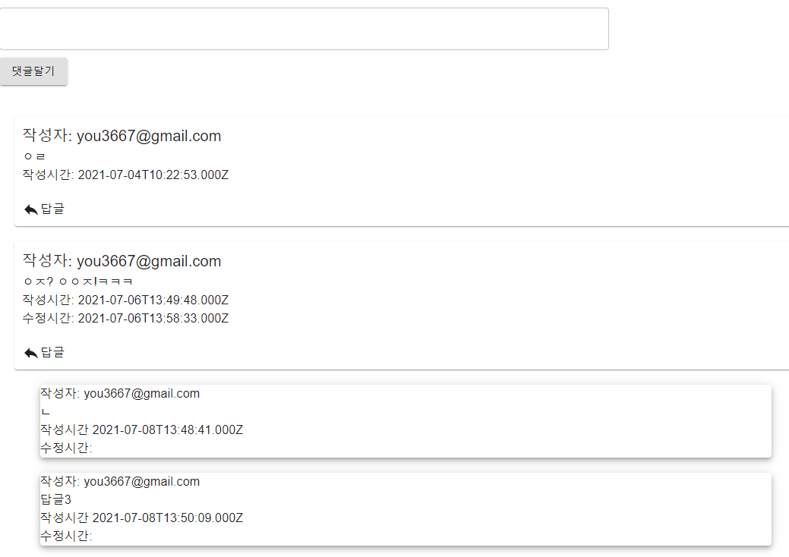
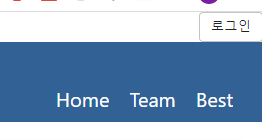
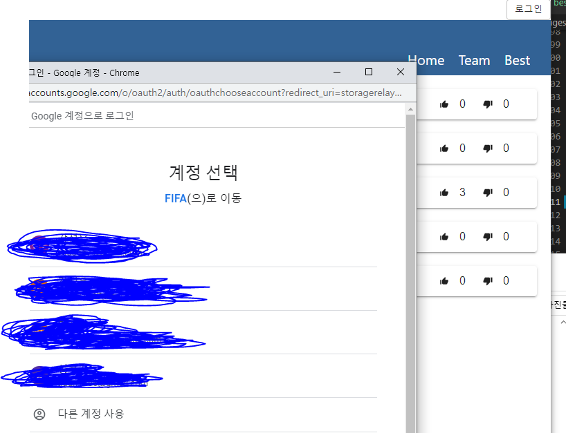
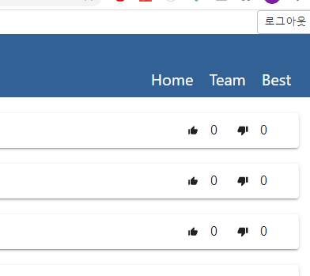
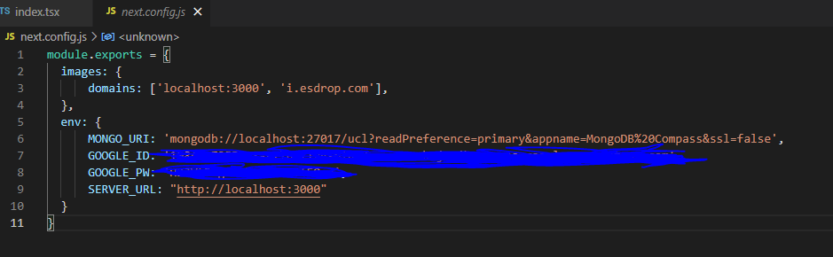
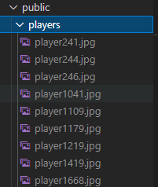

    Create your Own Best11!
    Next.js + MongoDB + Typescript + Google OAuth2.0

Comment&Repply

Best Boards(Boards get more than three like. you can change best Boads line)

Pagination

 
Like&Dislike

#
[1] setting Google OAuth2.0
#
I used Google OAuth2.0 for login&logout system.
 
If Google Oauth Setting is success, when click the login button

you can see google account list

and logout button 

#
[2] create and setting next.config.js in root folder.  
#

if you run this project locally, Setting 
  
SERVER_URL: "http://localhost:3000"
 
images: {
 
    domains: ['localhost:3000', 'i.esdrop.com']
}
 
  env: {
       
      MONGO_URI: 'mongodb://localhost:27017/[putYourDBName]?
       
      readPreference=primary&appname=MongoDB%20Compass&ssl=false',
       
      GOOGLE_ID: '[putYourGoogleOauthId]',
       
      GOOGLE_PW: '[putYourGoogleOauthPW]',
       
      SERVER_URL: "http://localhost:3000"
       
  }

put your mongodb_url, google oauth2.0's id and password. like below.
I used essdrop for club flag img.

if you wanna run this project heroku or aws or vercel... and so on...
change SERVER_URL, images domains, mongodb_uri.

#
[3] unzip public/players.zip and add players collections(players.json) in ur database.
#

I got players info(name, img) from https://www.kaggle.com/bryanb/fifa-player-stats-database

If you wanna add additional players or team, add player's info to players collection!
